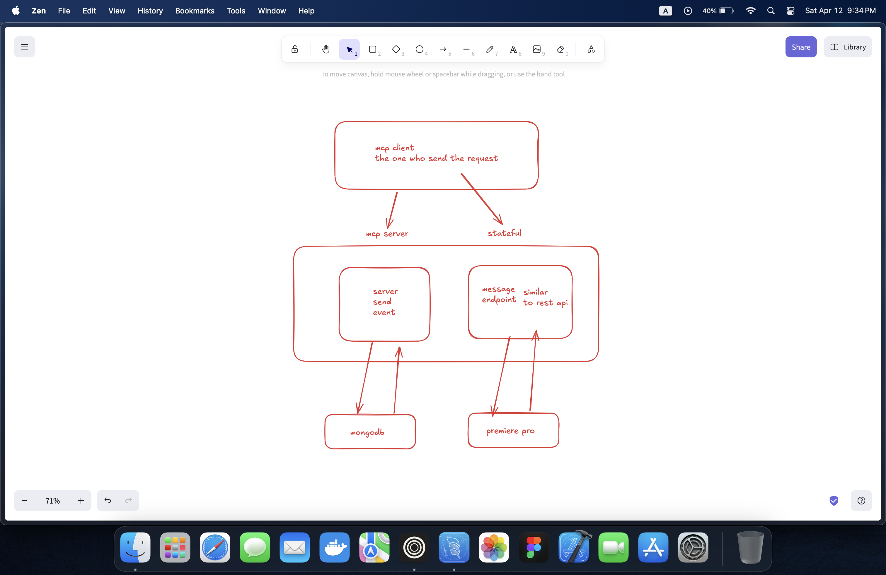

# MCP

llm can do

- write mail
- write query

llm cant do

- send mail
- run query

# mcp

cursor/windsurf is a client it talks with mcp server which has tools like

- write file
- read from docs
- read errors from console

so model context protocol is a standardised protocol for mcp server
open protocol that standardises how application provide context to llm

1. model

- ai model like gpt,gemini, claude

2. context

- most important for a llm

suppose you write "check if the error is discuss in github issue or slack channel

- by default llm cant perform it, but with the additional context from the mcp, we can

1. mcp server to get repo issue

- need access to repo issue

2. mcp server to get slack channel

- need access to slack channel

so the context can be type of:

1. tools :functions
2. resources :files(csv)
3. sampling: way to query other model
4. prompt: template for client

5. protocol

- set of rules

   0. mcp host -> ides

  1. mcp client -> 1:1 connection with server
  2. mcp server -> the one we need to create (tools)
  3. local data stores -> dbs
  4. remote services -> external services
